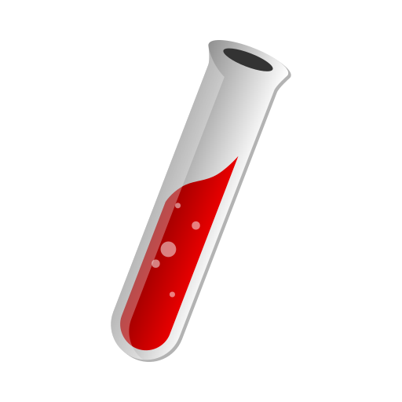

# Hi 👋, I'm Dawid

## Web Developer and Computer Science Student

- 📫 Want to work and create some cool stuff? Drop me an email at: [dawidk.lachowicz@gmail.com](mailto:dawidk.lachowicz@gmail.com)

### Languages and Technologies:

<!--
**dawidl022/dawidl022** is a ✨ _special_ ✨ repository because its `README.md` (this file) appears on your GitHub profile.

Here are some ideas to get you started:

- 🔭 I’m currently working on ...
- 🌱 I’m currently learning ...
- 👯 I’m looking to collaborate on ...
- 🤔 I’m looking for help with ...
- 💬 Ask me about ...
- 📫 How to reach me: ...
- 😄 Pronouns: ...
- ⚡ Fun fact: ...
-->
